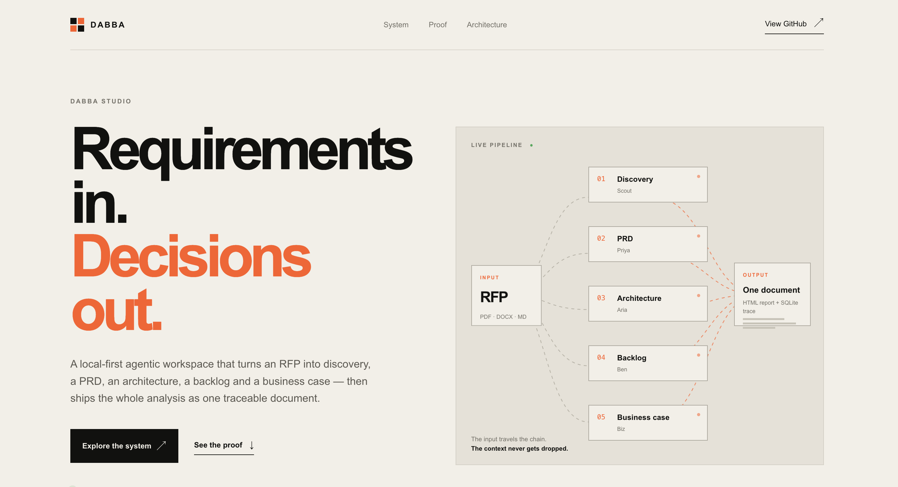
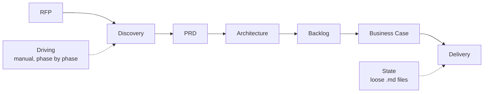
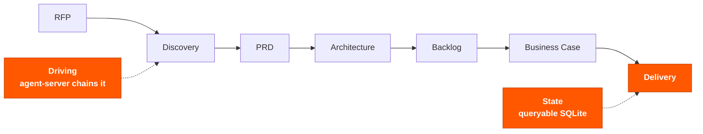

# DABBA



**DABBA** — *Discovery, Architecture, Backlog and Business Analysis* — is the
commercial identity of the **DPABB** agentic framework (technical internal
name, preserved in the code, packages, and architecture documentation).

Desktop product agent pipeline — Discovery, PRD,
Architect, Backlog, Business Case — as its own "OpenWorker": an agent that
runs locally, delivers real artifacts (documents, diagrams, backlog), and
connects to the tools the user already relies on.

Inspired by architecture (desktop shell + agent server + connectors), adapted for
Node/TypeScript and for the DPABB-Framework's technical requirements-analysis
domain.

---

```
RFP  →  5 chained phases  →  Persisted state  →  Consolidated document
```

*Instead of a specialist driving the analysis phase by phase, the input
document travels the chain on its own and comes out the other end as a
package ready for the client.*

---

## 1. The Current Scenario

The method already existed and worked: five specialists, each with their own
scope, producing artifacts in the right order. What was expensive was the
driving — someone had to trigger each phase, carry context from one to the
next, and stitch together at the end what ended up scattered across loose
files. Delivery quality depended on who was driving.



> **The limitation:** the value wasn't locked in the agents — it was locked
> in the person who knew how to drive them.

## 2. What Changes

The analysis chain stays exactly the same — the same five phases, in the
same order, with the same personas and the same commands defined in the
original framework. What changes is the layer around it: driving stops being
a person and becomes the `agent-server`; state stops being a loose file and
becomes a queryable database; delivery stops being a handful of markdown
files and becomes a single document.



The five phases stay gray because they weren't touched — the highlight marks
only what actually changed.

**What came in to support the change**

| Layer | Component | Role |
|-------|-----------|------|
| Driving | `agent-server/src/pipeline/orchestrator.ts` | Chains the 5 phases, passing each phase's artifact as the premise for the next |
| State | `agent-server/src/db/sqlite.ts` | Persists every run and every artifact, along with the model that produced it |
| Delivery | `agent-server/src/pipeline/htmlReport.ts` | Consolidates all phases into a single HTML document |
| Interface | `gui/` (DABBA Studio) | Attach the RFP, follow the phases, open the result |

## 3. The Result

- **Analysis no longer depends on who drives it.** Whoever attaches the RFP
  doesn't need to know the phase order or how to carry context between them.
- **Full traceability.** Every artifact is recorded with the phase, the
  command, and the model that generated it — you can audit how each
  conclusion was produced.
- **Delivery in one piece.** The client gets a navigable document with the
  full content of all five phases, not a folder of files.
- **Cost under control.** Runs on the user's own key and, by default, on free
  models with automatic fallback when one fails or hits its quota.

### Proof

Real, end-to-end run from a sample RFP (`SmallProjectScopeRFP.pdf`):

| Measure | Value |
|---------|-------|
| Phases completed | 5 of 5 |
| Total time | 7min 15s |
| Manual interventions | 0 (after attaching the RFP) |
| Provider | OpenRouter, free models with fallback |
| Output | 1 consolidated HTML document + SQLite record |

---

## Sub-brands

| Name | Role |
|------|------|
| **DABBA Studio** | Main interface (this `gui/` + `desktop-shell/`) |
| **DABBA Agents** | The 5 specialized agents (Scout, Priya, Aria, Ben, Biz) |
| **DABBA Canvas** | Visual discovery (future) |
| **DABBA Architect** | Architecture generation (mapped to the `architect` agent) |
| **DABBA Business** | Business case and feasibility (mapped to the `business-case` agent) |

## Architecture

```
┌──────────────────────────────────────────────┐
│           desktop-shell (Tauri)               │  native shell + window
├────────────────────────────────────────────────┤
│         DABBA Studio (React + Vite)           │  chat, pipeline, artifacts
├────────────────────────────────────────────────┤
│         agent-server (Node/TypeScript)         │  DABBA Agents · pipeline · memory
├───────────────┬────────────────┬───────────────┤
│  memory.md /  │   connectors    │  model        │
│  artifacts    │  (Jira, Slack…) │  provider (BYOK)│
└───────────────┴────────────────┴───────────────┘
```

## Project structure

| Directory | Contents |
|-----------|----------|
| `agent-server/` | DABBA Agents engine (discovery, prd, architect, backlog, business-case), LLM execution (BYOK), pipeline state, memory |
| `gui/` | DABBA Studio — React interface consumed by desktop-shell (also usable in a plain browser during dev) |
| `desktop-shell/` | Tauri shell that packages the GUI and supervises the agent-server |
| `packaging/` | Installer build scripts (DMG, Windows) |
| `docs/` | Specs and architecture decisions |

## Status

- ✅ `agent-server`: agent registry + command execution via LLM (BYOK)
- ✅ `gui`: DABBA Studio consuming the agent-server (agent list, commands, execution)
- ✅ RFP/document upload: PDF, DOCX, HTML, TXT/MD → server-side text extraction
- ✅ Full pipeline: Discovery → PRD → Architecture → Backlog → Business Case,
  persisted in SQLite, with a final consolidated HTML document
- ✅ UI/UX: per-agent icons, dark mode, animated pipeline timeline, drag-and-drop
- ✅ Real Mac app: `agent-server` packaged as a Tauri sidecar (Node SEA),
  starts and stops automatically with the app — `.app`/`.dmg` working
- See the decision log in `docs/decisions.md`

---

## Installation & setup

Full walkthrough, from a clean checkout to a working `.dmg`. Two paths:
**Quick dev** (browser only, fastest to iterate) and **Full desktop app**
(Tauri, requires Rust).

### Prerequisites

| Tool | Why | Check |
|------|-----|-------|
| Node.js 20+ | Runs the agent-server and the GUI dev server | `node --version` |
| npm | Package manager (workspaces are npm-based) | `npm --version` |
| Rust + Cargo | Only needed for the desktop app (Tauri + sidecar build) | `rustc --version` |
| An LLM API key | OpenRouter (free-tier friendly) or Anthropic | — |

**Installing Rust** (skip if you only want the browser dev flow):

```bash
# macOS/Linux
curl --proto '=https' --tlsv1.2 -sSf https://sh.rustup.rs | sh
# then restart your shell, or:
source "$HOME/.cargo/env"
rustc --version   # confirms the toolchain is on PATH
```

### 1. Clone and install dependencies

```bash
git clone https://github.com/juliopessan/DABBA-STUDIO.git
cd DABBA-STUDIO
npm install   # installs all workspaces (agent-server, gui, desktop-shell)
```

### 2. Configure your LLM provider (BYOK)

The `agent-server` calls an LLM provider to execute agent commands. Copy the
template and fill in your key:

```bash
cp agent-server/.env.example agent-server/.env
```

**Option A — OpenRouter** (default, free-tier models with automatic fallback):

```bash
# agent-server/.env
OPENROUTER_API_KEY=sk-or-v1-...
# optional: override the list/order of free models tried
# DABBA_OPENROUTER_MODELS=nvidia/nemotron-nano-9b-v2:free,openai/gpt-oss-20b:free
```

If a free model errors out, returns 429 (rate limit), or runs out of quota,
`agent-server` automatically tries the next one in the list
(`agent-server/src/llm/openrouter.ts`). The response includes
`fallbackAttempts` listing which models failed before the one that
answered — shown in the GUI.

**Option B — Anthropic**:

```bash
# agent-server/.env
DABBA_LLM_PROVIDER=anthropic
DABBA_LLM_API_KEY=sk-ant-...
DABBA_LLM_MODEL=claude-sonnet-5   # optional, has a default
```

Without any key configured, the execution endpoint runs in **dry-run**
mode: it returns the prompt that would have been sent, without calling any
API — useful to verify the wiring before spending real tokens.

### 3. Quick dev (browser, no Rust needed)

Fastest way to iterate on the GUI or the agent-server:

```bash
# Terminal 1 — agent-server (port 8765)
cd agent-server && npm run dev

# Terminal 2 — DABBA Studio (browser, port 1420)
cd gui && npm run dev
```

Open `http://localhost:1420` in any browser. Attach an RFP, run the full
pipeline or a single agent, open the consolidated report — everything works
here except the native desktop behaviors (system tray, packaged `.dmg`,
auto-managed backend process).

### 4. Full desktop app (Tauri + sidecar)

The desktop build packages `agent-server` as a **sidecar**: a standalone
binary (Node SEA — Single Executable Application) that Tauri starts
automatically with the app and stops automatically when it quits. No manual
`npm run dev` for the backend once this is set up.

```bash
# 4a. Build the sidecar binary (once, or whenever agent-server changes)
cd agent-server
npm run build:sidecar
```

This downloads and caches an official static Node.js binary (~130MB, only
the first time), bundles `agent-server` into it via Node SEA, and outputs
`desktop-shell/src-tauri/binaries/agent-server-<target-triple>`.

```bash
# 4b. Run in Tauri dev mode (opens a native window, hot-reloads the GUI)
cd desktop-shell
npm run tauri dev
```

```bash
# 4c. Or build the installable app (.app + .dmg)
cd desktop-shell
npm run tauri -- build
```

The `.dmg` lands in
`desktop-shell/src-tauri/target/release/bundle/dmg/DABBA_<version>_aarch64.dmg`.
Drag `DABBA.app` into `/Applications`, double-click — the sidecar starts and
stops with the window, no terminal required.

**Important:** don't run `agent-server`'s `npm run dev` while using the
Tauri desktop app — both would fight over port 8765. Pick one path per
session: browser dev (step 3) or desktop app (step 4).

**Where the packaged app stores its data:** the sidecar can't write next to
itself (it's a single embedded binary, and the `.app` bundle should stay
read-only). Data lives at the OS-standard location instead:

| Platform | Path |
|----------|------|
| macOS | `~/Library/Application Support/DABBA/` |
| Windows | `%APPDATA%/DABBA/` |
| Linux | `~/.dabba/` |

That's where `dabba.sqlite`, the consolidated HTML reports
(`data/output/`), and the packaged app's `.env` (API key) live. In dev mode
(steps 1–3), `agent-server/.env` and `agent-server/data/` are used instead —
see `agent-server/src/appPaths.ts` for the exact resolution logic.

### Troubleshooting

- **`rustc: command not found`** after installing Rust: restart your
  terminal, or run `source "$HOME/.cargo/env"`.
- **`tauri dev`/`tauri build` fails looking for a sidecar binary:** run
  step 4a first — the binary isn't checked into git (`.gitignore`'d, ~130MB).
- **Stuck `.dmg` bundling** (`bundle_dmg.sh` fails intermittently): a leftover
  mounted volume from a previous attempt is usually the cause. Check
  `hdiutil info` for any `/Volumes/dmg.*` or `rw.*.dmg` and detach/remove
  them, then retry `tauri build`. Details in `docs/decisions.md`.
- **Port 8765 already in use:** something else is holding it — most likely
  a leftover `agent-server` dev process or a previous sidecar instance that
  didn't shut down. `lsof -i :8765` to find and stop it.
- **App opened after copying `DABBA.app` straight from the mounted `.dmg`
  window (without dragging it to Applications first):** don't. Drag
  `DABBA.app` into the `Applications` shortcut shown in the `.dmg` window,
  eject the volume, then launch from `/Applications`. Running it directly
  from the mounted (read-only) volume is unsupported and was the trigger
  for a real runaway-CPU bug found in the wild — fixed via
  `tauri-plugin-single-instance` (a second launch attempt now just
  focuses the existing window instead of spawning a second sidecar) plus
  an explicit working directory for the sidecar process, but installing
  properly remains the recommended path.
- **"Failed to connect to agent-server: Load failed" right after opening
  the app:** the GUI window can render before the sidecar finishes
  starting (especially on first launch, while Gatekeeper verifies the
  signature). The GUI retries the connection automatically for ~20s
  before giving up — if you still see this after 20+ seconds, something
  is actually wrong; check `Console.app` for `[agent-server]` log lines
  from the DABBA process.
- **First launch blocked by Gatekeeper** ("Apple could not verify..." or
  the app silently does nothing): right-click `DABBA.app` → **Open** →
  confirm **Open** in the dialog (bypasses Gatekeeper with a one-time
  confirmation). If that doesn't show any dialog at all, macOS may have
  flagged it as damaged instead — run
  `xattr -cr /Applications/DABBA.app` to clear the quarantine attribute,
  then open normally.

---

## Full pipeline (upload → 5 phases → consolidated report)

In the GUI's "Pipeline completo" section (or via the API), attach an RFP and
`agent-server` runs the 5 phases sequentially — each one using the previous
phase's artifact as its premise/context, in the order documented by the
original framework:

1. `discovery` (`*start`)
2. `prd` (`*generate`)
3. `architecture` (`*design`)
4. `backlog` (`*breakdown` → `*estimate` → `*staffing`)
5. `business-case` (`*analyze`)

Each artifact is saved to `dabba.sqlite` (`pipeline_runs` and
`phase_artifacts` tables). At the end, a consolidated HTML document (all
phases, full content — not a summary) is generated and served at
`GET /pipeline/:id/report.html`, styled with the DABBA Studio visual
identity.

**API:**
- `POST /pipeline/run { projectName, rfpText }` — kicks off the pipeline in
  the background, returns `runId` immediately
- `GET /pipeline/:id` — status + artifacts (for polling)
- `GET /pipeline/:id/report.html` — the consolidated document

**File upload:** `POST /extract-text` (multipart, `file` field) accepts PDF,
DOCX, HTML/HTM, and TXT/MD, returning the extracted text.
