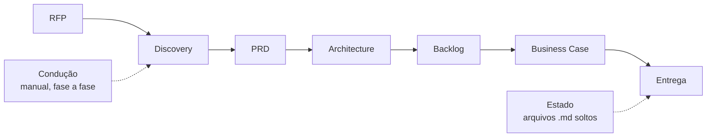
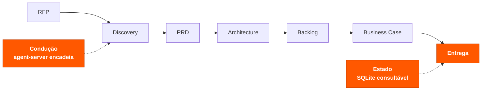

# DABBA

**DABBA** — *Discovery, Architecture, Backlog and Business Analysis* — é a
identidade comercial do framework agentic **DPABB** (nome técnico interno,
preservado no código, nos pacotes e na documentação de arquitetura).

Produto desktop (app + GUI + conectores) que expõe o pipeline de agentes do
[DPABB-Framework](../DPABB-Framework) — Discovery, PRD, Architect, Backlog,
Business Case — como um "OpenWorker" próprio: um agente que roda localmente,
entrega artefatos reais (documentos, diagramas, backlog) e se conecta às
ferramentas que o usuário já usa.

Inspirado na arquitetura do [OpenWorker](https://github.com/andrewyng/openworker)
(desktop shell + agent server + conectores), adaptado para Node/TypeScript e
para o domínio de análise de requisitos técnicos do DPABB-Framework.

---

```
RFP  →  5 fases encadeadas  →  Estado persistido  →  Documento consolidado
```

*Em vez de um especialista conduzir a análise fase a fase, o documento de
entrada percorre a cadeia sozinho e sai do outro lado como um pacote pronto
para o cliente.*

---

## 1. O Cenário Atual

O método já existia e funcionava: cinco especialistas, cada um com seu escopo,
produzindo os artefatos na ordem certa. O que custava caro era a condução —
alguém precisava acionar cada fase, carregar o contexto de uma para a outra e
juntar no fim o que ficou espalhado em arquivos soltos. A qualidade da entrega
dependia de quem estava conduzindo.



> **A limitação:** o valor não estava preso nos agentes, estava preso na pessoa
> que sabia conduzi-los.

## 2. O Que Muda

A cadeia de análise permanece exatamente a mesma — as cinco fases, na mesma
ordem, com as mesmas personas e os mesmos comandos definidos no framework
original. O que muda é a camada em volta: quem conduz deixa de ser uma pessoa e
passa a ser o `agent-server`, o estado deixa de ser arquivo solto e passa a ser
base consultável, e a entrega deixa de ser um punhado de markdown e passa a ser
um documento único.



As cinco fases seguem em cinza porque não foram tocadas — o destaque marca
apenas o que efetivamente mudou.

**O que entrou para sustentar a mudança**

| Camada | Componente | Papel |
|--------|-----------|-------|
| Condução | `agent-server/src/pipeline/orchestrator.ts` | Encadeia as 5 fases, passando o artefato de cada uma como premissa da seguinte |
| Estado | `agent-server/src/db/sqlite.ts` | Persiste cada execução e cada artefato, com o modelo que o produziu |
| Entrega | `agent-server/src/pipeline/htmlReport.ts` | Consolida todas as fases num documento HTML único |
| Interface | `gui/` (DABBA Studio) | Anexar a RFP, acompanhar as fases e abrir o resultado |

## 3. O Resultado

- **A análise não depende mais de quem conduz.** Quem anexa a RFP não precisa
  conhecer a ordem das fases nem como passar contexto entre elas.
- **Rastreabilidade completa.** Cada artefato fica gravado com a fase, o
  comando e o modelo que o gerou — dá para auditar como cada conclusão foi
  produzida.
- **Entrega em uma peça.** O cliente recebe um documento navegável com o
  conteúdo integral das cinco fases, não uma pasta de arquivos.
- **Custo sob controle.** Roda com a chave do próprio usuário e, por padrão,
  em modelos gratuitos com troca automática quando um deles falha ou estoura
  a cota.

### Prova

Execução real, de ponta a ponta, a partir de uma RFP de exemplo
(`SmallProjectScopeRFP.pdf`):

| Medida | Valor |
|--------|-------|
| Fases concluídas | 5 de 5 |
| Tempo total | 7min 15s |
| Intervenções manuais | 0 (após anexar a RFP) |
| Provider | OpenRouter, modelos gratuitos com fallback |
| Saída | 1 documento HTML consolidado + registro em SQLite |

---

## Sub-marcas

| Nome | Papel |
|------|-------|
| **DABBA Studio** | Interface principal (este `gui/` + `desktop-shell/`) |
| **DABBA Agents** | Os 5 agentes especializados (Scout, Priya, Aria, Ben, Biz) |
| **DABBA Canvas** | Discovery visual (futuro) |
| **DABBA Architect** | Geração de arquitetura (mapeado ao agente `architect`) |
| **DABBA Business** | Business case e viabilidade (mapeado ao agente `business-case`) |

## Arquitetura

```
┌──────────────────────────────────────────────┐
│           desktop-shell (Tauri)               │  shell nativo + janela
├────────────────────────────────────────────────┤
│         DABBA Studio (React + Vite)           │  chat, pipeline, artefatos
├────────────────────────────────────────────────┤
│         agent-server (Node/TypeScript)         │  DABBA Agents · pipeline · memory
├───────────────┬────────────────┬───────────────┤
│  memory.md /  │   conectores    │  provider de  │
│  artefatos    │  (Jira, Slack…) │  modelo (BYOK)│
└───────────────┴────────────────┴───────────────┘
```

## Estrutura

| Diretório | Conteúdo |
|-----------|----------|
| `agent-server/` | Motor dos DABBA Agents (discovery, prd, architect, backlog, business-case), execução via LLM (BYOK), pipeline state, memory |
| `gui/` | DABBA Studio — interface React consumida pelo desktop-shell (e utilizável em browser durante o dev) |
| `desktop-shell/` | Shell Tauri que empacota a GUI e supervisiona o agent-server |
| `packaging/` | Scripts de build de instaladores (DMG, Windows) |
| `docs/` | Specs e decisões de arquitetura |

## Status

- ✅ `agent-server`: registry de agentes + execução de comandos via LLM (BYOK)
- ✅ `gui`: DABBA Studio consumindo o agent-server (lista de agentes, comandos, execução)
- ✅ Upload de RFP/documentos: PDF, DOCX, HTML, TXT/MD → extração de texto server-side
- ✅ Pipeline completo: Discovery → PRD → Architecture → Backlog → Business Case,
  persistido em SQLite, com documento HTML consolidado final
- ✅ UI/UX: ícones por agente, dark mode, timeline animada do pipeline, drag-and-drop
- 🚧 `desktop-shell`: shell Tauri inicializado, empacotamento ainda pendente
- Ver histórico de decisões em `docs/decisions.md`

## Pipeline completo (upload → 5 fases → relatório consolidado)

Na seção "Pipeline completo" da GUI (ou via API), anexe uma RFP e o
`agent-server` roda as 5 fases sequencialmente — cada uma usando o
artefato da fase anterior como premissa/contexto, na ordem documentada no
framework original:

1. `discovery` (`*start`)
2. `prd` (`*generate`)
3. `architecture` (`*design`)
4. `backlog` (`*breakdown`)
5. `business-case` (`*analyze`)

Cada artefato é salvo em `agent-server/data/dabba.sqlite` (tabelas
`pipeline_runs` e `phase_artifacts`). Ao final, um documento HTML
consolidado (todas as fases, conteúdo completo — não um resumo) é gerado
em `agent-server/data/output/{runId}.html`, estilizado com a identidade
visual da DABBA Studio, e servido em `GET /pipeline/:id/report.html`.

**API:**
- `POST /pipeline/run { projectName, rfpText }` — dispara o pipeline em
  background, retorna `runId` imediatamente
- `GET /pipeline/:id` — status + artefatos (para polling)
- `GET /pipeline/:id/report.html` — documento consolidado

**Upload de arquivos:** `POST /extract-text` (multipart, campo `file`)
aceita PDF, DOCX, HTML/HTM e TXT/MD, retornando o texto extraído.

## Rodando localmente

```bash
# 1. Agent server (porta 8765)
cd agent-server && npm install && npm run dev

# 2. DABBA Studio (browser, dev — porta 1420)
cd gui && npm install && npm run dev

# 3. Desktop app completo (requer Rust/cargo instalado)
cd desktop-shell && npm install && npm run tauri dev
```

### Configurando um provider de modelo (BYOK)

O `agent-server` executa comandos dos agentes chamando um provider LLM.
Dois providers suportados, configuráveis via `agent-server/.env` (copie de
`.env.example`) ou variáveis de ambiente:

**OpenRouter (default, modelos free com fallback automático)**

```bash
OPENROUTER_API_KEY=sk-or-v1-...
# opcional: sobrescreve a lista/ordem de modelos free tentados
# DABBA_OPENROUTER_MODELS=nvidia/nemotron-nano-9b-v2:free,openai/gpt-oss-20b:free
```

Se um modelo free retornar erro, 429 (rate limit) ou quota estourada, o
`agent-server` tenta automaticamente o próximo da lista
(`agent-server/src/llm/openrouter.ts`). A resposta inclui `fallbackAttempts`
com os modelos que falharam antes do que respondeu — exibido na GUI.

**Anthropic (alternativa)**

```bash
DABBA_LLM_PROVIDER=anthropic
DABBA_LLM_API_KEY=sk-ant-...
DABBA_LLM_MODEL=claude-sonnet-5   # opcional, tem default
```

Sem nenhuma chave configurada, o endpoint de execução roda em modo
*dry-run*: retorna o prompt que seria enviado, sem chamar nenhuma API.
